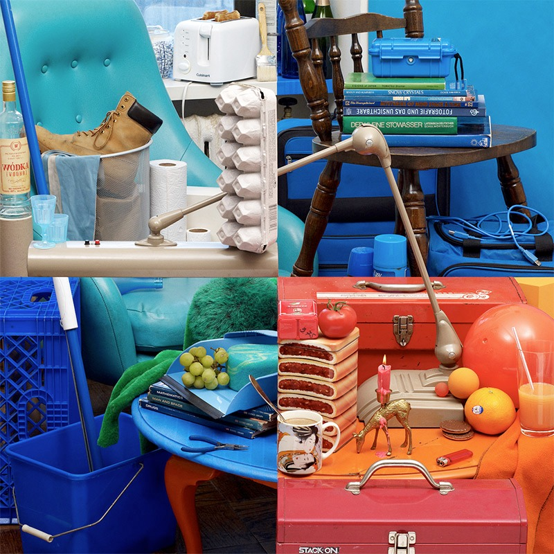

    

> "The idea was you had to do something to counteract your pure distractive consumerism. What Starbucks enables you to do is be a consumerist without any bad conscience because the price for the countermeasure, for fighting consumerism, is already included in the price of a commodity. You pay a little bit more, and you are not just a consumerist, but you also do your duty toward the environment, the poor starving people in Africa. It’s, I think, the ultimate form of consumerism." \
> [Slavoj Žižek](https://youtu.be/oBcFLmu_tlc?t=3293)

Whenever you feel intellectually cocky, read the work of a [brilliant twenty-something-year-old](https://www.cs.virginia.edu/~robins/Turing_Paper_1936.pdf) and remember that you are not special. At all. It will humble you. It *should* humble you.

I think intellectual endeavors have always involved a balance between consumption and creation. We read to write, observe to partake, and listen to speak. But today, the sheer volume, accessibility, and sophistication of available content have tipped the scales toward consumption for many people. We are overdosing on information.

"Edutainment" is the most insidious form of procrastination. It’s the intellectual equivalent of eating a bag of chips. I call it *critical thinking erosion*. And I, too, am not immune to it. I enjoy devouring information, but even when I step back and reflect on it, it’s actually my good memory playing tricks on me, fooling me into thinking that I’m actually learning something. More often than not, I’m not. I am simply under a spell.

Lately, I’ve become obsessed with attention hygiene. As we enter the *binary fog*, every click feels like flipping a tile in Minesweeper. Our attention is becoming pixelated, fragmented, and diluted. This fragmentation makes us more prone to mistakes. The quality of our work diminishes because we cannot sustain depth. We are paying the price for our digital gluttony. Sadly, it’s not just us who suffer the consequences. Our mistakes [ripple outward](https://www.bbc.com/news/articles/cr54m92ermgo), affecting others as well.

There has always been more human knowledge and experience than any one person could absorb. That truth has never changed. So how are we patching this debt?

My antidote to digital gluttony isn't a stricter information diet, but rather a commitment to creation. A stance switch, from collecting dots to connecting them. A process of metabolizing experience into something new, uniquely mine. The debt of human knowledge can only be paid forward through the compounding interest of creation.
