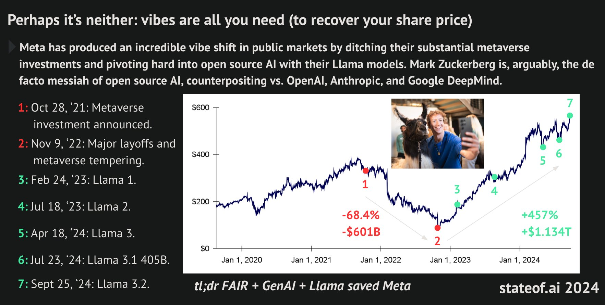

    

> Dog carcass in alley this morning, tire tread on burst stomach. This city is afraid of me. I have seen its true face.
The streets are extended gutters and the gutters are full of blood and when the drains finally scab over, all the vermin will drown.
The accumulated filth of all their sex and murder will foam up about their waists and all the whores and politicians will look up and shout "Save us!"... and I'll look down and whisper "**No**".
>
Rorschach's Journal \
October 12th, 1985

Everything becomes a fucking scam, entertained mainly by deep pockets with large foreheads hiding insidiously small amygdalae.

My country [failed for TikTok](https://www.politico.eu/article/romania-election-stunner-who-is-calin-georgescu-marcel-ciolacu/), but which hasn't? Friends tell me that “_if only people were more educated, this wouldn't have happened…_” I don't see that happening anytime soon. The reason: **Entertainment > Education**. Education has always been a distant second to entertainment. This was always the case. The Colosseum wasn't destroyed, not really. Its idea has perpetuated like an everlasting chant, intoxicating our minds to the point of being utterly lobotomized by the least experienced doctors: [the modern oligarchic, technocracy-infused political class](https://www.huffpost.com/entry/trump-musk-america-oligarchs_n_6746b6efe4b0800c73f710a5).

[Ban TikTok](https://www.wikiwand.com/en/articles/Restrictions_on_TikTok_in_the_United_States#Criticism), some say. Yet Google's recommendation algorithms would be just as pernicious without regulatory oversight. Corporations have evolved into stealth states, wielding influence far beyond borders. Governance? No. It’s a [global game of fake compliance](https://www.wikiwand.com/en/articles/Crony_capitalism).

Let's talk about AI instead since that's my bread and butter. What unsettles me most is the gloomy, eerie narrative shaping the future. A future us "GPU-poor plebs" must fight against.

Simping has reached its zenith. Tech-savvy bros morph into submissive followers, idolizing the gods of the Silicon Valley, nostrils closed to the stench of pissed street corners that might jar their VR headsets. Yes, Meta is amazing. Their research is of the highest quality. But the company's 5D chess game serves only its own long-term interests. Meta portrays itself as doing god's work by playing the OS card, instilling short-term hope, feigning altruism, and feeding us crumbs of [groomed-Zuck](https://disconnect.blog/mark-zuckerbergs-rebrand-is-a-master-class-in-distraction/)'s "magnanimity" while he's _openly_ building the future of the world. "_There's nothing more deceptive than an obvious fact._"

I picked Meta as an example since I find its strategy the most devious. It's not the only one, though. It's just the most visibly deceptive to me. And if you ever wondered, this is how winning looks like in the 21st century:

    

The AI-consuming, social media-obsessed masses are the perfect pawns in this game of deception. Much like the iPhone phenomenon, what happens if the commercial adoption of AI is driven not by its profound capabilities but by its status as the latest trend? We're constantly fed misinformation, and the steps to information acquisition have been reduced to a mere query. "_What's the truth about vaccines?_" we ask, and the AI responds with a mix of facts and carefully crafted caveats, leaving us to fill in the blanks with our own biases. "_But these are serious issues, highly debated among experts..._" it says, and we're left to conclude that the uncertainty is proof of the unknown, rather than a testament to the complexity of the issue.

The irony is that, in the process, we're voluntarily milking our own thoughts to feed the [100,000-GPU-and-growing](https://www.tomshardware.com/tech-industry/artificial-intelligence/elon-musk-plans-to-scale-the-xai-supercomputer-to-a-million-gpus-currently-at-over-100-000-h100-gpus-and-counting) clusters that power these AI behemoths. It's a self-perpetuating cycle of ignorance, and it's only going to get worse. For instance, try solving for Palantir in this equation:

$$
\begin{cases}
    \text{Palantir} + \text{Anthropic} + \text{D.O.D} &= \text{Defense} \\
    \text{Palantir} + \text{OpenAI} + \text{Anduril} &= \text{Defense}
\end{cases}
$$

What else can be done considering China [doesn't give a damn](https://www.perplexity.ai/page/chinese-military-builds-llama-cATtO04XQQmPAEHGEmR1AQ), operating on a different set of rules, showing no signs of slowing down and accelerating at a pace that would leave even the most average e/acc follower horny enough to start binging Chinese porn? The Chinese dominate the AI landscape. Their [war of a hundred models](https://www.perplexity.ai/page/china-s-war-of-a-hundred-model-DDDsuWBuRDylkUWBfOpOkQ) is their manifesto, and their [initiatives](https://www.perplexity.ai/page/china-s-initiatives-in-artific-a61GjWoJSZudk6x2W_LxvQ) in AI research has so far paid off, producing results that are nothing short of impressive.
Therefore, how else can the US stay competitive and maintain its hegemony?

[It's not easy from here](https://graymirror.substack.com/p/its-not-easy-from-here):
> "In the presence of the symbol, it is important to never mention the reality."

The decentralized technology that could save us is tainted by the reputation of scammers and charlatans, leaving us to choose between the devil we know and the devil we don't. But I still think that's the only way forward. I'll spend my upcoming holidays thinking about this more deeply. I've seen work already being done in this direction, for instance [Prime Intellect](https://www.primeintellect.ai/)'s decentralized trained 10B model [INTELLECT-1](https://x.com/PrimeIntellect/status/1844814829154169038) and [Varun](https://x.com/varun_mathur)'s [hyper.space](https://hyper.space/) project. These efforts must succeed. They have to.

Lastly, [in light of recent events](https://www.standard.co.uk/comment/luigi-mangione-charged-fake-id-united-healthcare-country-club-b1199175.html), I think that dying evokes the most ruthless form of self-awareness among the living. It becomes clear to me that, in defining [social murder](https://www.wikiwand.com/en/articles/Social_murder), Engels' words echo still:
>When one individual inflicts bodily injury upon another such that death results, we call the deed manslaughter; when the assailant knew in advance that the injury would be fatal, we call his deed murder. But when society places hundreds of proletarians in such a position that they inevitably meet a too early and an unnatural death, one which is quite as much a death by violence as that by the sword or bullet; when it deprives thousands of the necessaries of life, places them under conditions in which they cannot live—forces them, through the strong arm of the law, to remain in such conditions until that death ensues which is the inevitable consequence—knows that these thousands of victims must perish, and yet permits these conditions to remain, its deed is murder just as surely as the deed of the single individual; disguised, malicious murder, murder against which none can defend himself, which does not seem what it is, because no man sees the murderer, because the death of the victim seems a natural one, since the offence is more one of omission than of commission. **But murder it remains**.

Then the question worth asking is: [Are We Allowed To Laugh When A CEO Dies?](https://youtu.be/YCpVncEXZVE?si=ED8YiJXxcmJq3ny4)

And just to clear the air, _I like America_ already, thanks for asking, Elon.
