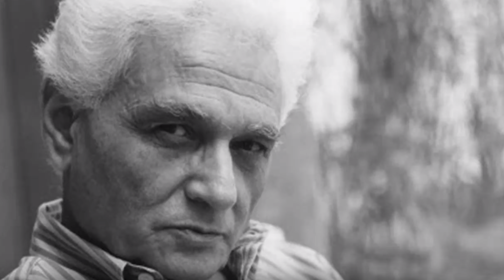

    

>  "Il n'y a pas de hors-texte." \
> —Derrida

"*Questioning builds a way*," [wrote](https://www2.hawaii.edu/~freeman/courses/phil394/The%20Question%20Concerning%20Technology.pdf) philosopher Martin Heidegger.
The way to living genuinely.
A question that doesn't seek an answer but rather a way to live with itself.
This is the essence of *deconstruction*.

In my childhood, my parents gifted me a fire truck toy.
I can't find the original, but it resembles this [one](/assets/2025-01-03-deconstruction/truck.jpg).
I used to pick apart everything that fell into my hands in search of hidden treasures.
It all started with that toy.
Then on, I always wanted to *peek inside*.
Each object told a story.
Each object held a different secret.
That habit stuck with me, hardened into a way of living.
Unknowingly, deconstruction crept into my bloodstream.

I stumbled upon Derrida's work in my mid-twenties.
The man was circling the same orbit I’d been in since childhood, only he had the vocabulary.
He insisted that the final objective of deconstruction is never to annihilate the conceptual oppositions but to tease them open, show how they depend on each other, and remain forever suspended in a perennial dance of contrast.
I never intended to join Derrida’s congregation; I simply found him waiting for me.
At the same time, it was close enough to my routine of ripping the backs off of things to expose their guts.

*Différance* is the central concept in Derrida's philosophy.
It's an interplay between "[difference](https://www.merriam-webster.com/dictionary/difference)" and "[deferral](https://www.merriam-webster.com/dictionary/deferral)".
Its birth was nurtured by Heidegger's *destruktion*, which sought to expose the underlying historical artifacts that were traditionally imposed on a word's function.
Derrida called that underlying layer *trace*.
A trace is the mark or sign of something that is absent, yet it influences or shapes the present.
It refers to the lingering effect or impression left by something that is no longer there (or not yet there).
It’s not fully present or visible, but it’s also not entirely absent.
It exists in a [liminal space](https://en.wikipedia.org/wiki/Liminal_space_(aesthetic)).
Essentially, there's never a moment when we can say we've reached the end of a concept.
"[Things fall apart; the centre cannot hold;](https://www.poetryfoundation.org/poems/43290/the-second-coming)" as Yeats put it.

Every word stands on a battlefield, tethered by a string of associations.
[There is no outside-text](https://www.goodreads.com/book/show/85326.Of_Grammatology).
The gripping unavoidability of *context* is at the heart of différance.
In [dismantling the rationality assumption behind game theory](https://www.goodreads.com/book/show/126238960-strategy-and-conscience), Rapoport concluded that "*context is everything*."
Context *is* everything.
It feeds the keen eye of the deconstructionist the means to bridge the [different similarities and the similar differences](https://www.goodreads.com/book/show/103625.On_Creativity); in Bohm's words,
> To express some fundamental feature of the order of natural process in terms of a universal law is, however, actually to assert what are the basic differences that are relevant for the whole of this process, and what are the corresponding similarities in these differences.

The idea of language as a transparent tool for representing a stable reality is cracked.
Consider the word "red."
The word "red" doesn't inherently mean anything.
Its meaning stems from the fact that it's not "blue" or "green," it's a color and not a number (yet again, *inversion* at play).
[We think in buckets](https://youtu.be/NNnIGh9g6fA?list=PL848F2368C90DDC3D&t=1030).
We internalize "red" as what it's not and call the resulting stability understanding.

I like the analogy of language *refracting* rather than *reflecting*.
A reflection is often taken to be an accurate, faithful representation of something.
Imagine standing before a mirror.
Refraction, in contrast, occurs when light passes through a medium like water or glass and bends.
The image or reality you perceive is altered.
This is what I believe Derrida suggested language does.
It does not directly mirror reality but distorts it through its own system of differences and its inability to fully capture presence or essence.
Therefore, language seems to *create* meaning rather than to simply *transmit* it.
It emphasizes this idea of *constructedness of reality*, since language structures our perception of the world and the "reality" we experience is shaped by the "refractions of language".
We use those refractions to arhitect models of the world.
But the models are not the world.
The models align synergistically to form the horizon line, a conceptual boundary.
In projective geometry, the horizon line can be thought of as the locus of points where parallel lines meet at infinity.
Does a model of reality's "horizon line" ever intersect with reality?
Or are the models just [points at infinity](https://en.wikipedia.org/wiki/Point_at_infinity) rendering the "horizon line"?
If we take "reality" to mean physical reality as it exists independently of our perception or representation, then the horizon line never truly intersects reality.
It is always a conceptual tool or a perceptual artifact.
If we consider "reality" as experienced or modeled reality, then the horizon line is deeply intertwined with our interpretation of reality.
While it might not "intersect" in a physical sense, it influences and shapes how we perceive and engage with reality.
Sorry for this off tangent.

While Derrida probably hated inversion, I think it's an operational necessity.
And while I like exploring philosophical rabbit holes, I'm not a philosopher.
Derrida always shouted that deconstruction is not a method (among many other things), and that its meaning should amount to "*what deconstruction is not, or rather ought not to be*."
If the term is defined, it would over-determine the idea of deconstruction and would close off the openness that Derrida wishes to preserve.
It would make the concept of critique immune to itself being deconstructed.
For instance, Beardsworth argued that
> Derrida is careful to avoid this term [method] because it carries connotations of a procedural form of judgement. A thinker with a method has already decided how to proceed, is unable to give him or herself up to the matter of thought in hand, is a functionary of the criteria which structure his or her conceptual gestures. For Derrida [...] this is irresponsibility itself. Thus, to talk of a method in relation to deconstruction, especially regarding its ethico-political implications, would appear to go directly against the current of Derrida's philosophical adventure.

However, I don't share the same sentiment.
Let me explain.

My argument rests on the idea that, as long as deconstruction *resists closure*, it will always be open to being deconstructed.
But deconstruction's resistance to closure isn't just about keeping things open-ended; it's about actively destabilizing any attempt at closure, including its own operations.
This mirrors Gödel's incompleteness theorems.
Just as any formal system complex enough to describe itself must contain statements that cannot be proven within that system, deconstruction's self-reflexive nature ensures it can never fully close upon itself.
The [consistency-completeness](https://en.wikipedia.org/wiki/G%C3%B6del%27s_incompleteness_theorems#Formal_systems:_completeness,_consistency,_and_effective_axiomatization) limitation is a fundamental aspect of any system that can describe itself.
Resisting closure hinges on the distinction between "orientation" and "method."
An orientation toward questioning doesn't predetermine our reading because the very nature of the questioning keeps transforming.
Each text we encounter might challenge not just what we think about texts, but how we think about questioning itself.
Thus, the real issue isn't with "method" in general, but with any attempt to stabilize deconstruction into a set of reliable moves or procedures.
Even if those procedures are framed as "always question everything," the moment we treat this as a reliable procedure, we've missed something essential about deconstruction's radical instability.

§

Deconstructing the stage reveals the puppeteer, a distorted postmodern Babel.
The digital realm deals in the commerce of symbols.
Postindustrial culture thrives on that.
Lyotard once warned us about [The Postmodern Condition](https://www.goodreads.com/book/show/252648.The_Postmodern_Condition): grand narratives get replaced by fragmented “[language-games](https://en.wikipedia.org/wiki/Language_game_(philosophy)),” and we revolve around the commodity of information rather than tangible goods.

This decentralized production of meaning aligns perfectly with the ethos of deconstruction.
In a world where linguistic and symbolic systems dominate, meaning becomes a fluid commodity.
It's traded, manipulated, and refracted across platforms.
AI systems like ChatGPT and DALL-E don't produce knowledge in the traditional sense.
They echo Derrida's notion of the *trace*: every output is a product of what is present (the input and algorithm) and what is absent (unrepresented contexts, cultural assumptions, or subjective experiences).
To drive this point home, when I mentioned that what is absent shapes the outputs, I meant that these "absences" exert a kind of spectral influence.
The absence is not simply a void but an active, shaping force in meaning.
They create a kind of "shadow meaning" that haunts the surface of the text.
What might have been said but wasn't, what might have been meant but remains unsaid.

Postmodern culture revels in the interplay of presence and absence.
Grand narratives dissolve into a meshwork of competing discourses, each vying for attention in an overcrowded infosphere.
In this context, deconstruction becomes a survival strategy, teaching a way to navigate the cacophony without succumbing to its illusions of coherence.

Machine translation exemplifies the fragmentary nature of meaning, resonating with Quine’s [indeterminacy of translation](https://en.wikipedia.org/wiki/Indeterminacy_of_translation).
When a term from one language is translated into another, the absence of a perfect equivalent forces the creation of new associations, shaped by cultural assumptions and historical contexts.
This process doesn’t reflect a failure of translation but rather the richness of différance.
As Quine argued, meaning is not fixed but emerges from a web of linguistic and cultural relationships.
Each translation carries traces of linguistic peculiarities, reminding us that meaning is always in motion, never static, refracted through the systems of language and thought.

In this shifting landscape, Lyotard’s warning finds renewed relevance.
The fragmented language-games of postmodernity are no longer confined to human discourse; they are encoded into the architectures of our machines.
AI, in its relentless parsing and reassembling of data, enacts the very instability that deconstruction seeks to expose.
It performs the work of différance on an industrial scale, fracturing meaning even as it seeks to assemble it.

As we engage with these systems, we occupy a paradoxical position: both creators and products of the symbolic economy.
Our thoughts, conversations, and identities are mediated through technologies that deconstruct us even as we use them to deconstruct the world.
In this intricate web of relations, we are neither autonomous individuals nor passive subjects.
We are nodal points in a dynamic, ever-evolving network, a reality captured eloquently by Lyotard:
> "A self does not amount to much, but no self is an island; each exists in a fabric of relations that is now more complex and mobile than ever before. Young or old, man or woman, rich or poor, a person is always located at 'nodal points' of specific communication circuits, however tiny these may be."

We're therefore left to question everything, even the frameworks in which our questions arise.
